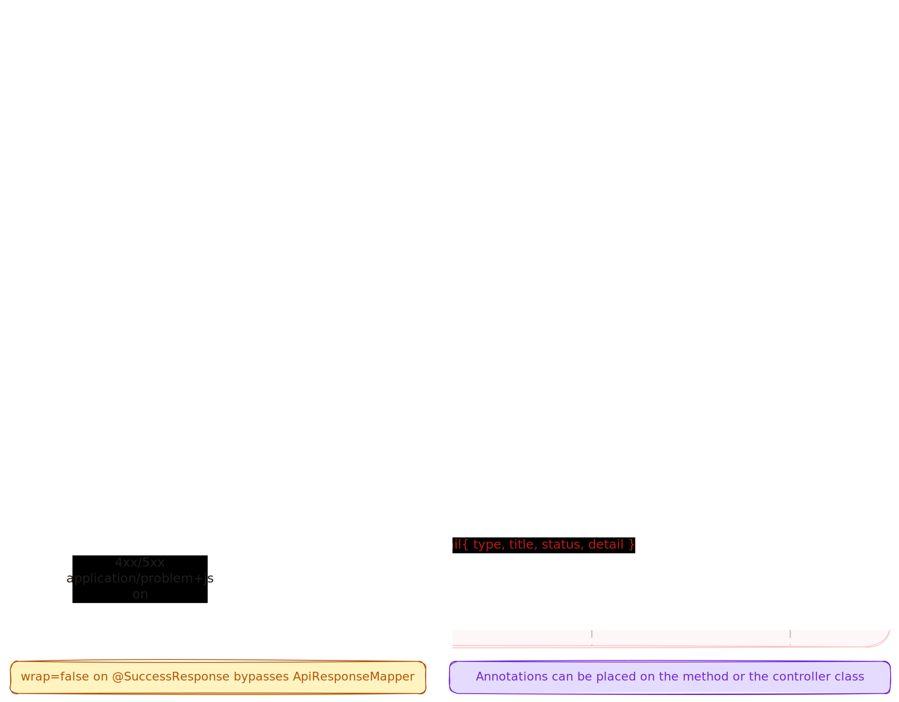

# response4j

A framework-agnostic Java library for standardized API success and error responses aligned with [RFC 9457 Problem Details for HTTP APIs](https://www.rfc-editor.org/rfc/rfc9457) with first-class support for major frameworks such as Spring, Quarkus, Micronaut.

## Features

- **RFC 9457 compliant** — Error responses follow the Problem Details specification
- **Immutable records** — Core models use Java Records for thread-safe, immutable data structures
- **Framework-agnostic core** — Use `response4j-core` with any Java application, with or without a web framework
- **Spring Boot support** — Optional `response4j-spring` module with auto-configuration
- **Quarkus support** — Optional `response4j-quarkus` module with CDI producers and JAX-RS integration
- **Micronaut support** — Optional `response4j-micronaut` module with bean factory and exception handler
- **Simple annotations** — `@ProblemResponse` for automatic exception mapping
- **Consistent error structure** — All error responses share a predictable RFC 9457 JSON shape

## Requirements

- **Java 21+**
- **Maven 3.6+**

## Compatibility

| response4j | Java | Spring Boot | Quarkus | Micronaut |
|------------|------|-------------|---------|-----------|
| 0.1.0      | 21+  | 3.5.x       | 3.22.x  | 4.10.x    |

## Modules

| Module                 | Description                                                                                                                                              |
|------------------------|----------------------------------------------------------------------------------------------------------------------------------------------------------|
| `response4j-core`      | Core models (`ApiResponse`, `ProblemDetail`), annotations, and mappers. No framework dependencies.                                                       |
| `response4j-spring`    | Spring Boot auto-configuration: exception handler, response body advice. Depends on Spring Web MVC and Boot.                                             |
| `response4j-quarkus`   | Quarkus integration: CDI producers for mappers, JAX-RS exception mapper, container response filter. Depends on Quarkus REST (RESTEasy Reactive) and Arc. |
| `response4j-micronaut` | Micronaut integration: bean factory for mappers, HTTP server filter, exception handler. Depends on Micronaut HTTP, server, and inject.                   |

## Installation

### Maven

Add the dependency for your use case.

**Core only** (framework-agnostic):

```xml
<dependency>
    <groupId>io.github.response4j</groupId>
    <artifactId>response4j-core</artifactId>
    <version>0.1.0</version>
</dependency>
```

**Spring Boot** (includes core):

```xml
<dependency>
    <groupId>io.github.response4j</groupId>
    <artifactId>response4j-spring</artifactId>
    <version>0.1.0</version>
</dependency>
```

**Quarkus** (includes core):

```xml
<dependency>
    <groupId>io.github.response4j</groupId>
    <artifactId>response4j-quarkus</artifactId>
    <version>0.1.0</version>
</dependency>
```

**Micronaut** (includes core):

```xml
<dependency>
    <groupId>io.github.response4j</groupId>
    <artifactId>response4j-micronaut</artifactId>
    <version>0.1.0</version>
</dependency>
```

### Building from Source

```bash
git clone https://github.com/iamkavindu/response4j.git
cd response4j
mvn clean install
```

## Usage

### Spring Boot

With `response4j-spring` on the classpath, beans are auto-configured. No extra setup required. Auto-configuration only activates in a web application context (`@ConditionalOnWebApplication`). The registered beans (`ProblemDetailMapper`, `Response4jExceptionHandler`) are conditional on `@ConditionalOnMissingBean`, so either can be replaced by declaring your own bean of the same type.

#### Error responses

Annotate exception classes with `@ProblemResponse` to control how they are mapped to RFC 9457 Problem Details:

```java
@ProblemResponse(status = 404, title = "User Not Found")
public class UserNotFoundException extends RuntimeException {
    public UserNotFoundException(Long id) {
        super("User with id " + id + " was not found");
    }
}

@ProblemResponse(status = 400, title = "Validation Error", type = "https://api.example.com/errors/validation")
public class ValidationException extends RuntimeException {
    public ValidationException(String message) {
        super(message);
    }
}
```

The example above (`UserNotFoundException`) produces the following response:

```json
{
  "type": "about:blank",
  "title": "User Not Found",
  "status": 404,
  "detail": "User with id 42 was not found"
}
```

Unannotated exceptions produce `Content-Type: application/problem+json` with status 500:

```json
{
  "type": "about:blank",
  "title": "Internal Server Error",
  "status": 500,
  "detail": "An unexpected error occurred"
}
```

#### Problem extensions

Add custom fields to problem details using `@ProblemExtension`. This annotation is repeatable, allowing multiple extensions on the same exception class:

```java
@ProblemResponse(status = 400, title = "Validation Error",
    type = "https://api.example.com/errors/validation")
@ProblemExtension(key = "docs", value = "https://api.example.com/docs/validation")
@ProblemExtension(key = "supportEmail", value = "support@example.com")
public class ValidationException extends RuntimeException {
    public ValidationException(String message) {
        super(message);
    }
}
```

Extension fields appear as top-level properties in the JSON response:

```json
{
  "type": "https://api.example.com/errors/validation",
  "title": "Validation Error",
  "status": 400,
  "detail": "Invalid email format",
  "docs": "https://api.example.com/docs/validation",
  "supportEmail": "support@example.com"
}
```

### Quarkus

With `response4j-quarkus` on the classpath, a CDI bean (`ProblemDetailMapper`) is auto-produced. A JAX-RS `ExceptionMapper` handles exception mapping automatically.

Annotate exception classes with `@ProblemResponse` (with optional `@ProblemExtension`) the same way as with Spring Boot:

```java
@Path("/users")
public class UserResource {

    @GET
    @Path("/{id}")
    public User getUser(@PathParam("id") Long id) {
        return userService.findById(id);
    }
}
```

### Micronaut

With `response4j-micronaut` on the classpath, a bean factory auto-registers `ProblemDetailMapper` when Micronaut HTTP is present. `Response4jExceptionHandler` maps exceptions to RFC 9457 Problem Details automatically.

Annotate exception classes with `@ProblemResponse` (with optional `@ProblemExtension`) the same way as with Spring Boot or Quarkus:

```java
@Controller("/users")
public class UserController {

    @Get("/{id}")
    public User getUser(@PathVariable Long id) {
        return userService.findById(id);
    }
}
```

### Validation Errors

For validation scenarios with multiple field-level errors, use `ProblemDetailError` to represent individual field errors and `ProblemDetail.ofErrors()` to create a problem response containing them:

```java
import io.github.response4j.core.model.ProblemDetail;
import io.github.response4j.core.model.ProblemDetailError;

List<ProblemDetailError> errors = List.of(
    new ProblemDetailError("/email", "must be a valid email address"),
    new ProblemDetailError("/age", "must be at least 18"),
    new ProblemDetailError("username", "is already taken")
);

ProblemDetail problem = ProblemDetail.ofErrors(
    "Validation Failed",
    400,
    "The request contains invalid fields",
    errors
);
```

The resulting JSON response includes an `errors` array as an extension field:

```json
{
  "type": "about:blank",
  "title": "Validation Failed",
  "status": 400,
  "detail": "The request contains invalid fields",
  "errors": [
    {
      "pointer": "/email",
      "detail": "must be a valid email address"
    },
    {
      "pointer": "/age",
      "detail": "must be at least 18"
    },
    {
      "pointer": "username",
      "detail": "is already taken"
    }
  ]
}
```

The `pointer` field can be a JSON Pointer (RFC 6901) like `/email` or `/user/profile/age`, or a simple field name like `username`.

### Core (framework-agnostic)

Use `response4j-core` without any framework. `ProblemDetailMapper` can be called directly anywhere:

```java
ProblemDetailMapper mapper = new ProblemDetailMapper();

// Annotated exception — mapping driven by @ProblemResponse on the exception class
ProblemDetail problem = mapper.map(exception, "/api/users/42");

// Or construct manually for advanced use cases
ProblemDetail problem = ProblemDetail.of("Not Found", 404, "Resource not found", null, null);

// Using ProblemDetail.Builder for full control
ProblemDetail notFound = new ProblemDetail.Builder()
    .type(ProblemTypes.ABOUT_BLANK)
    .title("Not Found")
    .status(404)
    .detail("Resource not found")
    .build();

// Validation errors
List<ProblemDetailError> errors = List.of(
    new ProblemDetailError("/email", "must be a valid email address"),
    new ProblemDetailError("/age", "must be at least 18")
);
ProblemDetail validation = ProblemDetail.ofErrors(
    "Validation Failed",
    400,
    "The request contains invalid fields",
    errors
);
```

## API Reference


### `ProblemDetail`

| Field        | Type                  | Description                                                     |
|--------------|-----------------------|-----------------------------------------------------------------|
| `type`       | `URI`                 | Problem type (RFC 9457)                                         |
| `title`      | `String`              | Short summary                                                   |
| `status`     | `int`                 | HTTP status                                                     |
| `detail`     | `String`              | Explanation for this occurrence                                 |
| `instance`   | `String`              | Optional instance URI                                           |
| `extensions` | `Map<String, Object>` | Optional extra fields (serialized as top-level JSON properties) |

Factory methods: `of(title, status, detail, instance, extensions)`, `ofErrors(title, status, detail, errors)`. Both default `type` to `about:blank`.

Use `ProblemDetail.Builder` for full field control, including custom `type` URIs:

```java
ProblemDetail problem = new ProblemDetail.Builder()
    .type(URI.create("https://api.example.com/errors/not-found"))
    .title("Not Found")
    .status(404)
    .detail("Resource not found")
    .instance("/api/users/42")
    .build();
```

### `ProblemDetailError`

| Field     | Type     | Description                                                    |
|-----------|----------|----------------------------------------------------------------|
| `pointer` | `String` | JSON Pointer (RFC 6901) or field name identifying error source |
| `detail`  | `String` | Human-readable explanation of this specific error              |

Used in `ProblemDetail.extensions` under the `"errors"` key for multi-problem responses (validation scenarios).

### `ProblemTypes`

Utility class providing constants for well-known problem type URIs:

| Constant      | Value                                                   | Description                                        |
|---------------|---------------------------------------------------------|----------------------------------------------------|
| `ABOUT_BLANK` | `URI.create("about:blank")`                             | Indicates no specific problem type documentation   |
| `IANA_BASE`   | `"https://iana.org/assignments/http-problem-types#"`    | Base URI for IANA-registered problem types         |

### `ProblemDetailMapper`

Maps `Throwable` instances to RFC 9457 `ProblemDetail`. Used by all framework integration modules and directly in standalone applications.

| Method                     | Description                                                         |
|----------------------------|---------------------------------------------------------------------|
| `map(exception)`           | Maps `exception` without an instance URI.                           |
| `map(exception, instance)` | Maps `exception` with an instance URI (typically the request path). |

When the exception class is annotated with `@ProblemResponse`, annotation values are used. Blank `title` falls back to the exception class simple name. When `type` is `about:blank` and `title` is blank, `title` is replaced with the HTTP reason phrase per RFC 9457 Section 4.2.1. Unannotated exceptions produce a `500 Internal Server Error` response with `type: about:blank`, `title: "Internal Server Error"`, and the exception message used as the `detail` field.

### `@ProblemResponse`

| Attribute                 | Default                                   | Description                                                                                                                                                                                                                  |
|---------------------------|-------------------------------------------|------------------------------------------------------------------------------------------------------------------------------------------------------------------------------------------------------------------------------|
| `status`                  | `500`                                     | HTTP status code                                                                                                                                                                                                             |
| `title`                   | `""` (falls back to exception class name) | Short summary                                                                                                                                                                                                                |
| `type`                    | `"about:blank"`                           | Problem type URI. When `about:blank` and `title` is blank, title is automatically replaced with the HTTP reason phrase per RFC 9457 Section 4.2.1. When `title` is explicitly set, it is preserved as-is regardless of type. |
| `detail`                  | `""`                                      | Detail text                                                                                                                                                                                                                  |
| `includeExceptionMessage` | `true`                                    | Use exception message as detail when `detail` is blank                                                                                                                                                                       |

### `@ProblemExtension`

| Attribute | Description                                               |
|-----------|-----------------------------------------------------------|
| `key`     | Extension field name (appears as top-level JSON property) |
| `value`   | Extension field value (serialized as string)              |

**Repeatable:** Apply multiple times on the same exception class. The `@ProblemExtensions` container annotation is auto-applied by the compiler.

## Project Structure

```
response4j/
├── response4j-core/          # Framework-agnostic core
│   └── src/main/java/.../
│       ├── annotation/       # @ProblemResponse, @ProblemExtension, @ProblemExtensions
│       ├── mapper/           # ProblemDetailMapper
│       └── model/            # ProblemDetail, ProblemDetailError, ProblemTypes
├── response4j-spring/        # Spring Boot integration
│   └── src/main/java/.../
│       ├── autoconfigure/    # Response4jAutoConfiguration
│       └── handler/          # Response4jExceptionHandler
├── response4j-quarkus/       # Quarkus integration
│   └── src/main/java/.../
│       ├── producer/         # Response4jProducer (CDI)
│       └── mapper/           # Response4jExceptionMapper
├── response4j-micronaut/     # Micronaut integration
│   └── src/main/java/.../
│       ├── factory/          # Response4jFactory (beans)
│       └── handler/          # Response4jExceptionHandler
└── pom.xml
```

## License

[Apache License, Version 2.0](https://www.apache.org/licenses/LICENSE-2.0)

## Contributing

1. Fork the repository
2. Create a feature branch
3. Make your changes
4. Format code with Spotless before building:
   ```bash
   mvn spotless:apply
   ```
   This project enforces [Palantir Java Format](https://github.com/palantir/palantir-java-format) via the [Spotless Maven plugin](https://github.com/diffplug/spotless). The `spotless:check` goal runs automatically during the `compile` phase, so the build will fail if code is not correctly formatted.
5. Run `mvn clean verify`
6. Submit a pull request
